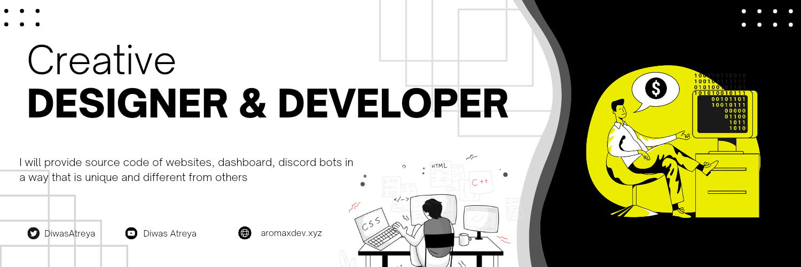

<br>

```js
const diwas = {
    pronouns: "He" | "Him",
    askMeAbout: ["app dev", "web dev", "tech"],
    technologies:{
        backEnd: ["nodejs", "express", "python"],
        frontEnd: ["bootstrap", "css"],
        database: ["mongoDB"],
        certificate: ["2nd runner up BIC Hackathon", "verified discord developer", "etc"]
    },
    skills: ["playing-guitar", "leadership", "problem-solving", "graphic-designer"],
}
```
